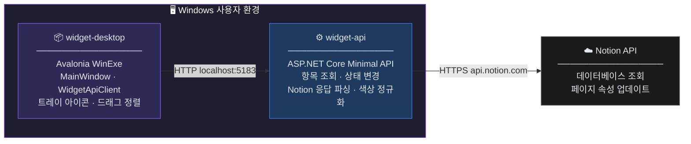
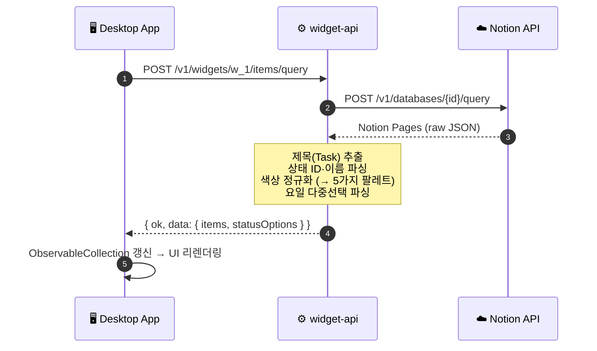
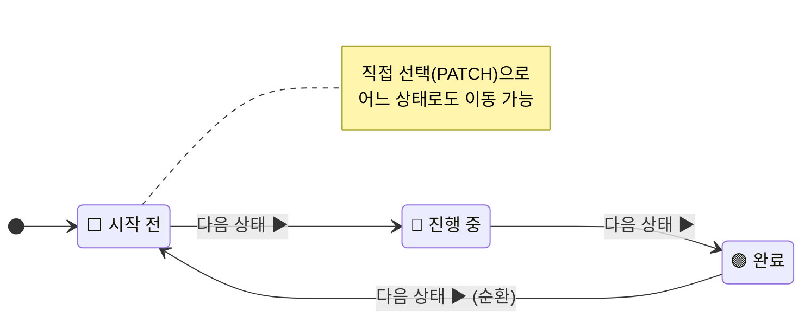

<div align="center">

# 🟣 NotionWidget

**Notion 데이터베이스를 실시간으로 연동하는 Windows 데스크톱 할 일 위젯**

Notion을 열지 않고도 오늘의 할 일을 확인하고, 작업 상태를 바로 변경할 수 있습니다.

<br/>


</div>

---

## 목차

1. [프로젝트 개요](#1-프로젝트-개요)
2. [주요 기능](#2-주요-기능)
3. [기술 스택](#3-기술-스택)
4. [시스템 아키텍처](#4-시스템-아키텍처)
5. [디렉터리 구조](#5-디렉터리-구조)
6. [API 명세](#6-api-명세)
7. [데이터 모델](#7-데이터-모델)
8. [빠른 시작](#8-빠른-시작)
9. [환경 변수](#9-환경-변수)

---

## 1. 프로젝트 개요

| 항목 | 내용 |
|------|------|
| **목적** | Notion 데이터베이스의 할 일을 데스크톱 위젯으로 표시·관리 |
| **대상 OS** | Windows 10 / 11 |
| **사용자** | Notion을 업무 도구로 활용하는 개인 사용자 |
| **언어** | 한국어 (UI 및 상태 레이블) |

시스템 트레이에 상주하는 프레임리스 위젯으로, Notion 앱을 열지 않고 오늘의 할 일 목록을 확인하고 완료 처리할 수 있습니다.

---

## 2. 주요 기능

<table>
  <tr>
    <td>📅 <b>요일별 필터링</b><br/>월~일 버튼으로 오늘의 할 일만 표시</td>
    <td>🔄 <b>상태 순환 전환</b><br/>버튼 클릭 한 번으로 다음 상태로 이동</td>
  </tr>
  <tr>
    <td>🎯 <b>상태 직접 선택</b><br/>상태 뱃지 클릭 → 드롭다운으로 선택</td>
    <td>↕️ <b>드래그앤드롭 정렬</b><br/>FLIP 애니메이션으로 부드러운 순서 변경</td>
  </tr>
  <tr>
    <td>🌗 <b>다크 / 라이트 모드</b><br/>버튼 또는 스와이프 제스처로 전환</td>
    <td>🖥️ <b>시스템 트레이 상주</b><br/>숨기기·보이기, 윈도우 시작 시 자동 실행</td>
  </tr>
  <tr>
    <td>💾 <b>창 위치 자동 저장</b><br/>재실행 시 이전 위치·크기 복원</td>
    <td>🪟 <b>프레임리스 커스텀 창</b><br/>모든 가장자리 리사이즈 지원</td>
  </tr>
</table>

---

## 3. 기술 스택

### 🖥️ 데스크톱 앱 — `apps/widget-desktop`

| 항목 | 내용 |
|------|------|
| 언어 / 런타임 | C# / .NET 9.0 |
| UI 프레임워크 | [Avalonia UI](https://avaloniaui.net/) 11.3.10 (크로스플랫폼 XAML 프레임워크) |
| UI 테마 | Avalonia.Themes.Fluent |
| 폰트 | Inter (영문) + Malgun Gothic (한글 fallback) |
| 빌드 출력 | `WinExe` — Windows 단독 실행 파일 |

### ⚙️ 백엔드 API — `services/widget-api`

| 항목 | 내용 |
|------|------|
| 언어 / 런타임 | C# / .NET 9.0 |
| 프레임워크 | ASP.NET Core Minimal API |
| 외부 연동 | Notion REST API v1 (`2022-06-28`) |
| HTTP 클라이언트 | .NET 내장 `HttpClient` (외부 NuGet 없음) |

---

## 4. 시스템 아키텍처

### 컴포넌트 구성



### 데이터 흐름 — 할 일 목록 조회



### 작업 상태 흐름



> **상태 전환 방법**
> - **다음 상태 버튼** — 항목 우측 버튼 클릭 → 순서대로 다음 상태로 자동 이동
> - **상태 직접 선택** — 상태 뱃지 클릭 → 드롭다운에서 원하는 상태 지정

---

## 5. 디렉터리 구조

```
NotionWidgetProject/
│
├── apps/
│   └── widget-desktop/            ← 🖥️ Avalonia 데스크톱 앱
│       ├── Converters/            ← UI 바인딩용 값 변환기 (색상 → Brush)
│       ├── Models/                ← API 응답 매핑 DTO
│       │   ├── ItemDto.cs                  # 할 일 항목 (INotifyPropertyChanged)
│       │   ├── QueryItemsResponseDto.cs    # 목록 조회 응답
│       │   ├── StatusOptionDto.cs          # 상태 옵션
│       │   └── StatusUpdateResponseDto.cs  # 상태 변경 응답
│       ├── Services/
│       │   └── WidgetApiClient.cs ← widget-api HTTP 클라이언트
│       ├── Styles/
│       │   ├── WidgetTheme.cs     ← 색상·폰트 상수 정의
│       │   └── WidgetStyles.axaml ← XAML 전역 스타일
│       ├── App.axaml(.cs)         ← 앱 진입점, 트레이 아이콘, 자동 실행 레지스트리
│       ├── MainWindow.axaml       ← 메인 창 레이아웃 (XAML)
│       └── MainWindow.axaml.cs    ← 메인 창 로직 (드래그·필터·테마·상태 관리)
│
├── services/
│   └── widget-api/                ← ⚙️ ASP.NET Core Minimal API
│       ├── Program.cs             ← 모든 엔드포인트 + Notion 연동 로직
│       └── appsettings.json       ← 로깅 설정 (Notion 자격증명은 환경변수)
│
├── shared/
│   └── contracts/                 ← 공유 인터페이스 예약 (현재 미사용)
│
└── README.md
```

---

## 6. API 명세

**Base URL:** `http://localhost:5183`

모든 응답은 아래 공통 envelope 형식을 따릅니다.

```jsonc
// 성공
{ "ok": true,  "data": { ... } }

// 실패
{ "ok": false, "error": "오류 메시지" }
```

---

###  `/`

헬스 체크

```json
{ "app": "widget-api", "ok": true }
```

---

###  `/health`

```json
{ "ok": true }
```

---

###  `/v1/widgets/{widgetId}/items/query`

Notion 데이터베이스에서 할 일 항목 목록과 상태 옵션을 조회합니다.

**Path Parameters**

| 파라미터 | 타입 | 설명 |
|----------|------|------|
| `widgetId` | `string` | 위젯 식별자 (현재 `w_1` 고정) |

<details>
<summary><b>응답 예시</b> <code>200 OK</code></summary>

```json
{
  "ok": true,
  "data": {
    "items": [
      {
        "id": "notion-page-id",
        "title": "작업 제목",
        "status": "진행 중",
        "statusId": "notion-status-option-id",
        "statusColor": "blue",
        "days": ["월요일", "수요일"],
        "note": "메모 내용",
        "lastEditedTime": "2026-05-09T10:00:00.000Z"
      }
    ],
    "statusOptions": [
      { "id": "option-id-1", "name": "시작 전", "color": "gray"  },
      { "id": "option-id-2", "name": "진행 중", "color": "blue"  },
      { "id": "option-id-3", "name": "완료",    "color": "green" }
    ]
  }
}
```

</details>

---

###  `/v1/widgets/{widgetId}/items/{itemId}/status/next`

항목의 상태를 다음 순서로 변경합니다 (순환: 시작 전 → 진행 중 → 완료 → 시작 전).

**Path Parameters**

| 파라미터 | 타입 | 설명 |
|----------|------|------|
| `widgetId` | `string` | 위젯 식별자 |
| `itemId` | `string` | Notion 페이지 ID |

<details>
<summary><b>응답 예시</b> <code>200 OK</code></summary>

```json
{
  "ok": true,
  "data": {
    "id": "notion-page-id",
    "statusId": "new-status-option-id",
    "status": "진행 중",
    "lastEditedTime": "2026-05-09T10:01:00.000Z"
  }
}
```

</details>

---

###  `/v1/widgets/{widgetId}/items/{itemId}/status`

항목의 상태를 지정한 값으로 직접 변경합니다.

**Path Parameters**

| 파라미터 | 타입 | 설명 |
|----------|------|------|
| `widgetId` | `string` | 위젯 식별자 |
| `itemId` | `string` | Notion 페이지 ID |

**Request Body**

```json
{ "statusId": "notion-status-option-id" }
```

<details>
<summary><b>응답 예시</b> <code>200 OK</code></summary>

```json
{
  "ok": true,
  "data": {
    "id": "notion-page-id",
    "statusId": "notion-status-option-id",
    "status": "완료",
    "lastEditedTime": "2026-05-09T10:02:00.000Z"
  }
}
```

</details>

---

## 7. 데이터 모델

### `ItemDto` — 할 일 항목

> `INotifyPropertyChanged` 구현으로 상태 변경 시 UI가 즉시 갱신됩니다.

| 필드 | 타입 | 설명 |
|------|------|------|
| `Id` | `string` | Notion 페이지 ID |
| `Title` | `string` | 작업 제목 |
| `Status` | `string` | 현재 상태 이름 (`시작 전` / `진행 중` / `완료`) |
| `StatusId` | `string` | Notion 상태 옵션 ID |
| `StatusColor` | `string` | 정규화된 색상 (`blue` / `green` / `yellow` / `red` / `gray`) |
| `Days` | `List<string>` | 연관 요일 목록 (`월요일` ~ `일요일`) |
| `Note` | `string` | 메모 텍스트 |
| `LastEditedTime` | `string` | Notion 마지막 수정 시각 (ISO 8601) |
| `UiOrder` | `int` | 드래그앤드롭으로 조정된 화면 순서 |
| `IsChecked` | `bool` | 완료 여부 (computed — `Status == "완료"`) |

### `StatusOptionDto` — 상태 옵션

| 필드 | 타입 | 설명 |
|------|------|------|
| `Id` | `string` | Notion 상태 옵션 ID |
| `Name` | `string` | 상태 이름 |
| `Color` | `string` | 정규화된 색상 |

### 색상 정규화 — Notion → 앱 팔레트

Notion의 다양한 색상 이름을 앱 내 5가지 팔레트로 통일합니다.

| 앱 색상 | 배경 | 텍스트 | Notion 색상 매핑 |
|---------|------|--------|-----------------|
| `blue` | `#7AB8E8` | `#0C2E50` | `blue`, `blue_background` |
| `green` | `#72CFA0` | `#0F4028` | `green`, `teal`, `green_background`, `teal_background` |
| `yellow` | `#F0C456` | `#4A3000` | `yellow`, `orange`, `brown`, `*_background` |
| `red` | `#F49494` | `#4A1010` | `red`, `pink`, `purple`, `*_background` |
| `gray` | `#AABAC8` | `#2E3F4F` | `gray`, `default`, 그 외 모두 |

---

## 8. 빠른 시작

### 사전 요구사항

- [.NET 9.0 SDK](https://dotnet.microsoft.com/download/dotnet/9.0)
- Notion Internal Integration Token
- 연동할 Notion 데이터베이스 ID

### Notion 데이터베이스 스키마

widget-api가 올바르게 파싱하려면 아래 속성이 필요합니다.

| 속성 이름 | Notion 타입 | 필수 |
|-----------|------------|------|
| `Task` | Title | ✅ |
| `Status` | Status | ✅ |
| `Days` | Multi-select | ⬜ |
| `Note` | Rich Text | ⬜ |

### 실행

**1단계 — API 서버 시작**

```powershell
cd services/widget-api

$env:Notion__Token      = "secret_xxxxxxxxxxxxxxxxxxxx"
$env:Notion__DatabaseId = "xxxxxxxxxxxxxxxxxxxxxxxxxxxxxxxx"

dotnet run
# → http://localhost:5183 에서 실행
```

**2단계 — 데스크톱 앱 실행**

```powershell
cd apps/widget-desktop
dotnet run
```

> [!IMPORTANT]
> API 서버가 먼저 실행 중이어야 데스크톱 앱이 정상 동작합니다.

---

## 9. 환경 변수

### `widget-api`

| 변수 | 필수 | 기본값 | 설명 |
|------|:----:|--------|------|
| `Notion__Token` | ✅ | — | Notion Internal Integration Token |
| `Notion__DatabaseId` | ✅ | — | 연동할 Notion 데이터베이스 ID |

### `widget-desktop`

| 변수 | 필수 | 기본값 | 설명 |
|------|:----:|--------|------|
| `WIDGET_API_BASE_URL` | ⬜ | `http://localhost:5183` | widget-api 서버 주소 |

> 창 위치·크기 설정은 `%APPDATA%\NotionWidget\window.json`에 자동 저장됩니다.
